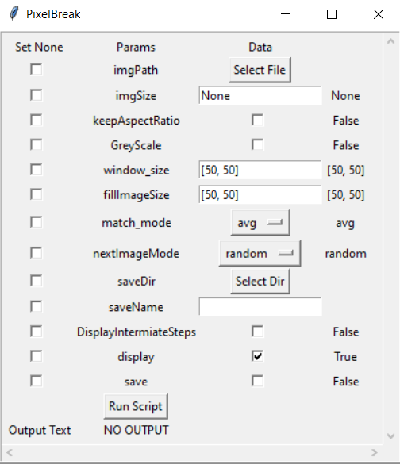

# PixelBreak
PixelBreak is a python application that can reconstruct images using smaller images/colours which can be used to create art

# Pixel Break UI
- UI to generate the effect easier

    

# Reconstructs Images using other images stored in database

Input Image

Output Image

# Image Database Management
- Add Images to Database

- UI to manage database easier

    

# Mass Image Generation

- Generate Colour Tinted Images from single image

    Input Image
    
    Output Images
    Average Shifted to BGR: (2, 55, 232)
    
    Average Shifted to BGR: (3, 196, 91)
    
    Average Shifted to BGR: (230, 199, 094)
    

- Generate Solid Colour Images

    
    
    
